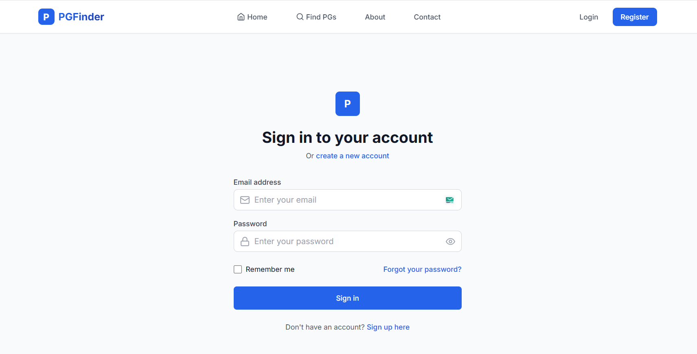
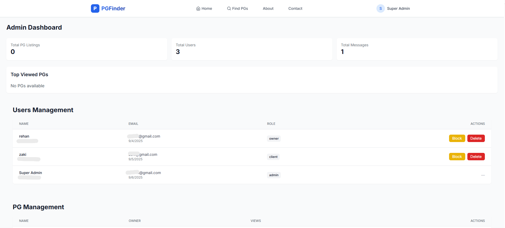
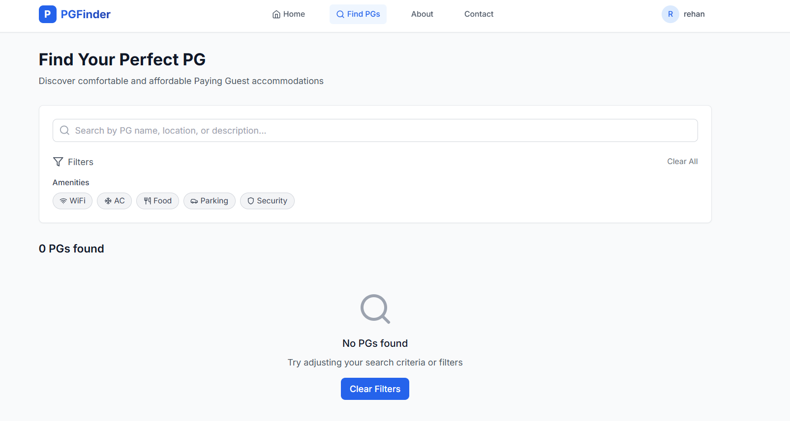

# 🏠 PGFinder - MERN Stack PG Accommodation Platform

A full-stack web application to help students and professionals **find and manage Paying Guest (PG) accommodations easily**.  
Built using the **MERN stack (MongoDB, Express.js, React.js, Node.js)** with a **clean, modern, and fully responsive UI**.

---

## 🚀 Overview

**PGFinder** connects PG owners and tenants on a single platform.  
Owners can list and manage their PGs, while tenants can search, filter, and contact owners directly — all in one place.

---


## 🖼️ Screenshots

### 🏠 Homepage


### 🔐 Login Page


### 📋 Dashboard


### 🔎 Search & Filters


---

## 🔑 Features

### 👩‍💼 For PG Owners
- Manage all PG listings through a dashboard  
- Add / edit / delete listings with multiple images  
- View and respond to tenant inquiries  
- Track views and engagement analytics  

### 🏡 For Tenants
- Advanced search with filters (location, price, amenities)  
- View detailed PG information and photos  
- Save favorite PGs for easy access  
- Contact PG owners directly  

### ⚙️ General Features
- Secure authentication (JWT-based)  
- Cloud image uploads with **Cloudinary**  
- Responsive and modern UI using **Tailwind CSS**  
- Real-time feedback and toast notifications  

---

## 🛠️ Tech Stack

**Frontend:** React.js, React Router, Tailwind CSS, React Query, Framer Motion  
**Backend:** Node.js, Express.js, MongoDB, Mongoose  
**Other Tools:** JWT, Cloudinary, Multer, bcryptjs, Helmet  

---

## 🧩 Project Structure

```bash
pgfinder/
│
├── frontend/               # React frontend
│   ├── public/
│   ├── src/
│   │   ├── components/     # Reusable components
│   │   ├── pages/          # Page components
│   │   ├── utils/          # Utility functions
│   │   └── index.js        # Entry point
│   ├── package.json
│   └── tailwind.config.js
│
├── backend/                # Node.js backend
│   ├── controllers/        # Controller logic
│   ├── models/             # MongoDB models
│   ├── routes/             # API routes
│   ├── middleware/         # Custom middleware
│   ├── config/             # DB & environment config
│   ├── server.js           # Entry point
│   ├── .env                # Environment variables (ignored)
│   ├── .env.example        # Example environment file
│   └── package.json
│
├── .gitignore              # Ignored files list
├── package.json            # Root configuration
└── README.md               # Documentation

```

## ⚡ Installation & Setup

### Prerequisites
- Node.js (v14+)
- MongoDB (local or Atlas)
- npm or yarn

### Steps

# Clone the repo
git clone <repository-url>
cd pgfinder

## Install dependencies (backend + frontend)
npm run install-all

## Create a .env file in backend/
```bash

PORT=5000
MONGODB_URI=your_mongodb_connection_string
JWT_SECRET=your_jwt_secret
CLOUDINARY_CLOUD_NAME=your_cloudinary_cloud_name
CLOUDINARY_API_KEY=your_api_key
CLOUDINARY_API_SECRET=your_api_secret

```
## Start the development servers
npm run dev


---
🧠 Learning Highlights

Full MERN stack project setup from scratch

REST API design with authentication and validation

State management using React Query and Context API

Integration of Cloudinary for image handling

Deployment readiness for Render (backend) and Vercel (frontend)

---

🧠 Learning Highlights

Full MERN stack project setup from scratch

REST API design with authentication and validation

State management with React Query and Context API

Integration of Cloudinary for image handling

Deployment readiness for Render & Vercel

## 🧑‍💻 Author

Rehan Pathan
💼 MERN Stack Developer | Passionate about full-stack projects
🌐 GitHub Profile : https://github.com/rehanpathan0801


⭐ If you like this project, don’t forget to star the repository!
PGFinder — Making PG accommodation search simple and efficient 🏠✨